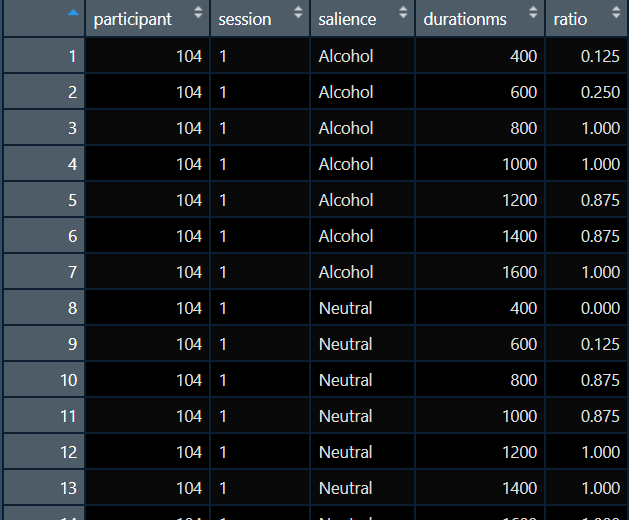

# Bringing Everything Together. Part I {#session7}

## Reflecting on Day 1

In **Day 1**, we generally introduced individual packages and functions. We also introduced Tidyverse, or to be fair, some aspects of it. In Day 2, the approach will be different. Our work will be aim driven and in each of the following **sessions** we will have a driving aim.


## Learning Objectives  
Working with the datafile **"alcohol_exp.csv"** we want to bring the dataset to a form where we could carry out analysis of variance (analyses if we want to be precise). This dataset includes a number of variables. Below we will discuss those of interest. We will exclude some of the variables as they were generated by Psychopy and are actual psychological variables.


**A few words on the dataset variables**

1. **Participant**: a unique id that was assigned to each participant. This should be numeric.  
2. **group**: participants were either assigned to manipulation group 1 or 2. Group 1 did mindfulness meditation, group 2 did not (This is in practice the same variable as **meditation**). This variable should be a factor.  
3. **session**: each participant completed the experimental task twice. Once before the manipulation and once after. This should also be a factor. 
4. **image**: The image file that was shown during a trial of the experiment. In total 16 different images, eight alcohol related and eight neutral. We can tell if an image is alcohol related if they include the character "1" before the ".jpg" part. If the character is "2" then the image was neutral.  
5. **duration**: We have a total of seven durations (in seconds). These are 0.4,  0.6,  0.8,  1.0,  1.2,  1.4,  1.6. These can be treated as factor or as numerical. We will discuss the difference during the session. 
6. **response**: during each trial participants had to respond by pressing either "s" or "l" depending on whether they felt the stimulus stayed on the screen for *short* or *long* duration. This is a character variable but we should convert it to numerical so we can extract mean responses.
7. **meditation**: discussed above, the same as **group**. This should be a factor.
8. **gender**: self-explanatory 
9. **age**: self-explanatory 

**A few words on the design**  

For the above, we can say that **participant**, **group**, **meditation**, are between-subjects variables. Whereas, **session**, **image**, **duration**, are within-subjects variables.  
Our ultimate aim here is to carry out a three-way ANOVA with **session**, **image**, and **duration** as our IVs and **response** as our DV. Traditionally, you would need to have your file in the **wide** format to carry our this analysis in SPSS, where you would employ *repeated measures* and then declare your *between-subjects* variables.  
R operates in a different way, we have to have our dataset in the **long** format where our measurement in only in one column. We have to keep that in mind while we are working through the dataset. 

Our dataset should look like this just before our analysis:



**Steps to take**   

1. We are keeping variables **participant**, **meditation**, and **session**. Although we changed their location in the dataset (we will use the function **relocate()**).  
2. We have a new variable called **salience**, this was created from the information included in the variable **image** (we will use plenty of exciting toys here such as **mutate()**, **str_sub()**, and **case_when()**).  
3. We have a new variable called **durationms**, this is duration in ms (pretty much multiplied **duration** by 1000).
4. We have a new variable called **ratio**. Here we will have to carry out the bulk of the work. We will need to group and aggregate our data after we have numerical value instead of a character one for our **response**.


**Functions to be used**  

1. mutate()   
2. str_sub()   
3. case_when()   
4. as.factor()   (and other as.type functions)   
5. relocate()   
6. group_by()   
7. summarise()   
8. ungroup()   (and possibly some others too)   

**Packages to be used**  
1. tidyverse  
2. rstatix  


## Working with the file

At this point it is best to start a new project and call it **Day 2**. Once you have that up and running then create our first script for the day, I suggest naming it **3wANOVA**.   

Let us start by loading the data file and checking that our variables are of the correct type.

```{r eval=FALSE}
library(tidyverse)
library(rstatix)

## load the data file to the dataframe called exp
exp <- read_csv("alcohol_exp.csv") 

##inspect exp
head(exp)

## contrary to Day 1 approach we will not be constantly creating new dataframes
## we will create only one new dataframe called exp2
## lets begin by assigning correct variable types

exp2 <- exp %>% 
  mutate(group = as.factor(group)) %>% 
  mutate(session = as.factor(session)) %>%
  mutate(meditation = as.factor(meditation)) %>%
  mutate(gender = as.factor(gender)) %>%
  mutate(group = as.factor(group))
```

**Note** the above executed pipe block could be written as one **mutate**  

```{r eval=FALSE}
library(tidyverse)
library(rstatix)

## load the data file to the dataframe called exp
exp <- read_csv("alcohol_exp.csv") 

##inspect exp
head(exp)

## contrary to Day 1 approach we will not be constantly creating new dataframes
## we will create only one new dataframe called exp2
## lets begin by assigning correct variable types
exp2 <- exp %>% 
  mutate(group = as.factor(group), 
  session = as.factor(session), 
  meditation = as.factor(meditation),
  gender = as.factor(gender),
  group = as.factor(group))
```

And to be honest it could written in even simpler way:

```{r eval=FALSE}
library(tidyverse)
library(rstatix)

## load the data file to the dataframe called exp
exp <- read_csv("alcohol_exp.csv") 

##inspect exp
head(exp)

## contrary to Day 1 approach we will not be constantly creating new dataframes
## we will create only one new dataframe called exp2
## lets begin by assigning correct variable types
exp2 <- exp %>% 
mutate(across(c(group , session, meditation, gender, group), as.factor))
```

As you work more with tidyverse you can decide on the style and approach that suites you most. For the purposes of this training we will stick to the first approach so you can work out the steps that you followed.

Our variables should fine for now. Looking at the image provided, we want participant, meditation, and session to be the first three variables. Group seems to have been dropped. We will move **meditation** and **group** at the end of the dataframe  

```{r eval=FALSE}

## we will continue working on the dataframe exp2
## relocating meditation and group
exp2 <- exp2 %>% 
  relocate(meditation, .after = last_col()) %>% 
  relocate(group, .after = last_col())
```


We now want to create a new variable called **salience**. We know that the third character of the image filename represents alcohol or neutral image. We will exract that information and then create a new variable called **salience**.
```{r eval=FALSE}

## we will use str_sub() to extract the third character
## based on the value of that character we will assign a value 
## in our salience variable. Note how we are using case_when()
exp2 <- exp2 %>% 
  mutate(type = str_sub(image,3,3)) %>% 
  mutate(salience = case_when(
    type == '2'~"Neutral",
    type =='1'~"Alcohol"
  ))
```


We will now proceed to recode the response from "s" and "l" to 0 and 1. We will also create a new variable for duration in ms and not in seconds.

```{r eval=FALSE}

## a simple mutate here would also do the job
## each mutate is creating a new variable
exp2 <- exp2 %>% 
  mutate(durationms = duration*1000) %>% 
  mutate(responsenum = case_when(
    response == 'l'~ 1,
    response == 's'~ 0
  ))
```


We now have to deal with the fact that our DV is just trial responses. We want to aggregate these responses across participant, meditation, session, salience, and durationms. Here we will also create a new dataframe as our structure will change.

```{r eval=FALSE}

## we will group our data using the variables above
## and then we will calculate the mean of the responses
## these mean values will be assigned to the the new variable called ration
## do not forget to ungroup at the end of your grouping work
## we carried the variable meditation forward for your upcoming exercise
## we will drop it from the grouping as we do not need it for this
## three-way anova
exp3 <- exp2 %>% 
  group_by(participant, session, salience, durationms) %>% 
  summarise(ratio = mean(responsenum)) %>% 
  ungroup()

## make sure to inspect the exp3 dataframe to check that everything is in order
## you should be able to see that grouping and aggregating 
## also dropped all other undeclared variables
```

Let's do a final check on variable types and correct any discrepancies.
This is also a good point to take a short break.


