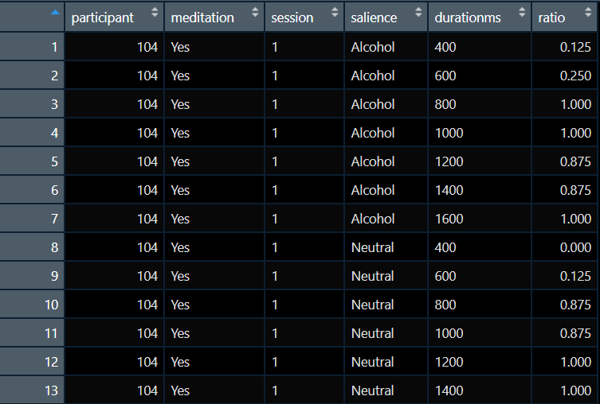

# Bringing Everything Together. Part I {#session7}

## Reflecting on Day 1

In **Day 1**, we generally introduced individual packages and functions. We also introduced Tidyverse, or to be fair, some aspects of it. In Day 2, the approach will be different. Our work will be aim driven and in each of the following **sessions** we will have a driving aim.

## Learning Objectives  
Working with the datafile **"alcohol_exp.csv"** we want to bring the dataset to a form where we could carry out analysis of variance (analyses if we want to be precise). This dataset includes a number of variables. Below we will discuss those of interest. We will exclude some of the variables as they were generated by Psychopy and are actual psychological variables.

**A few words on the dataset variables**

1. **Participant**: a unique id that was assigned to each participant. This should be numeric.  
2. **group**: participants were either assigned to manipulation group 1 or 2. Group 1 did mindfulness meditation, group 2 did not (This is in practice the same variable as **meditation**). This variable should be a factor.  
3. **session**: each participant completed the experimental task twice. Once before the manipulation and once after. This should also be a factor. 
4. **image**: The image file that was shown during a trial of the experiment. In total 16 different images, eight alcohol related and eight neutral. We can tell if an image is alcohol related if they include the character "1" before the ".jpg" part. If the character is "2" then the image was neutral.  
5. **duration**: We have a total of seven durations (in seconds). These are 0.4,  0.6,  0.8,  1.0,  1.2,  1.4,  1.6. These can be treated as factor or as numerical. We will discuss the difference during the session. 
6. **response**: during each trial participants had to respond by pressing either "s" or "l" depending on whether they felt the stimulus stayed on the screen for *short* or *long* duration. This is a character variable but we should convert it to numerical so we can extract mean responses.
7. **meditation**: discussed above, the same as **group**. This should be a factor.
8. **gender**: self-explanatory 
9. **age**: self-explanatory 

**A few words on the design**  

For the above, we can say that **participant**, **group**, **meditation**, are between-subjects variables. Whereas, **session**, **image**, **duration**, are within-subjects variables.  
Our ultimate aim here is to carry out a four-way ANOVA with **meditation**, **session**, **image**, and **duration** as our IVs and **response** as our DV. Traditionally, you would need to have your file in the **wide** format to carry our this analysis in SPSS, where you would employ *repeated measures* and then declare your *between-subjects* variables.  
R operates in a different way, we have to have our dataset in the **long** format where our measurement in only in one column. We have to keep that in mind while we are working through the dataset. 

Our dataset should look like this just before our analysis:

**Steps to take**   

1. We are keeping variables **participant**, **meditation**, and **session**. Although we changed their location in the dataset (we will use the function **relocate()**).  
2. We have a new variable called **salience**, this was created from the information included in the variable **image** (we will use plenty of exciting toys here such as **mutate()**, **str_sub()**, and **case_when()**).  
3. We have a new variable called **durationms**, this is duration in ms (pretty much multiplied **duration** by 1000).
4. We have a new variable called **ratio**. Here we will have to carry out the bulk of the work. We will need to group and aggregate our data after we have numerical value instead of a character one for our **response**.

**Functions to be used**  

1. mutate()   
2. str_sub()   
3. case_when()   
4. as.factor()   (and other as.type functions)   
5. relocate()   
6. group_by()   
7. summarise()   
8. ungroup()   (and possibly some others too)   

